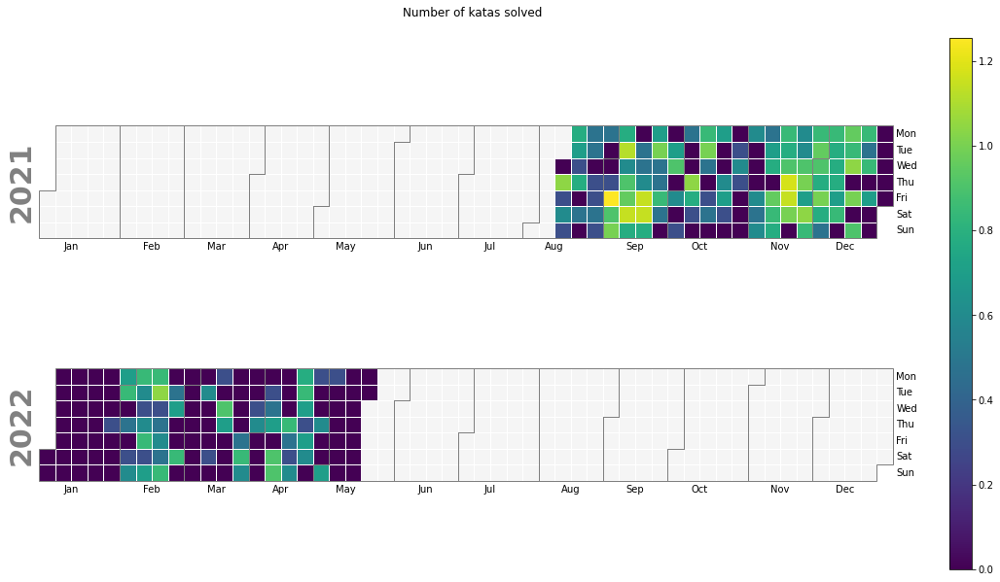
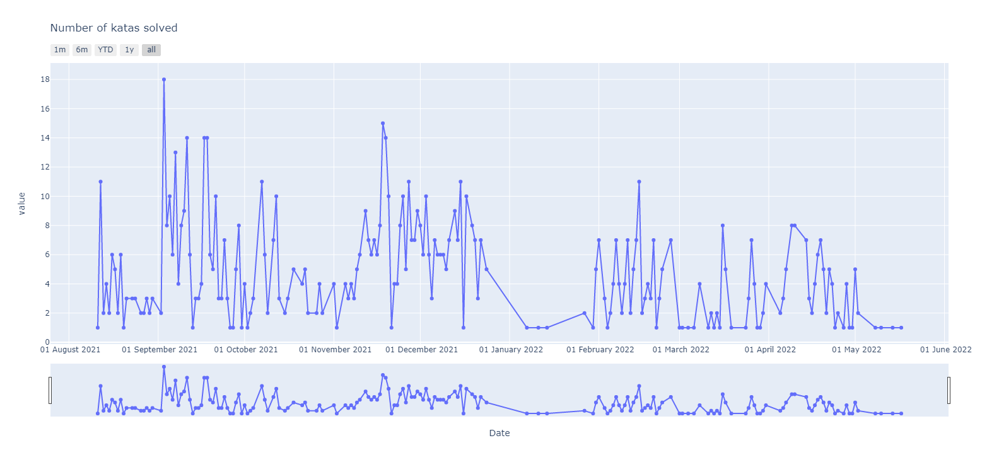
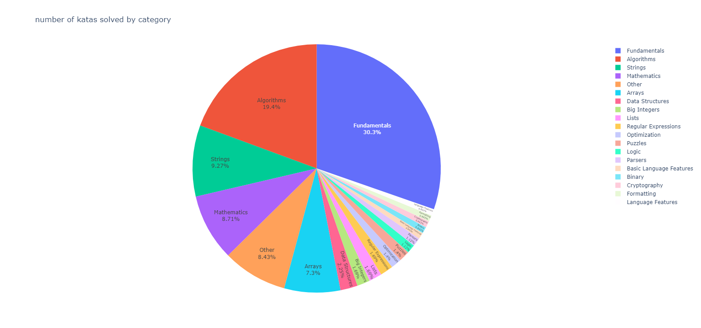
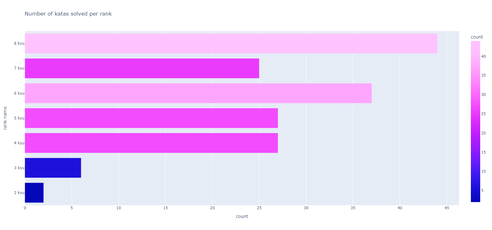
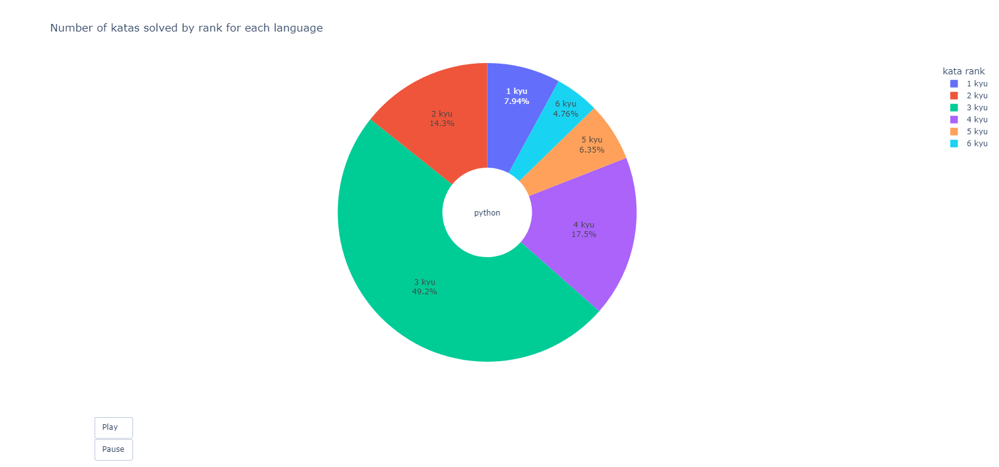

<p align="center">

 <h2 align="center"> stats visualiser</h2>
 <p align="center">Visualize your <a href="https://www.codewars.com/">codewars</a>
 training streaks and detailed stats on each language you have trained on. </p>
</p>


 


# Features #
[View online interactive version](https://creme332.github.io/codewars-stats-visualiser/)

## View  your activity ##




## View your training stats ##









# Usage # 

## Dependencies ##
```
python 3.9.7
numpy 1.20.3
calplot 0.1.7.4
matplotlib 3.4.3 
plotly 5.8.0
pandas 1.3.4
requests 2.26.0
ratelimit 2.2.1
```
- Fork project.
- Install all dependencies. (exact versions are not required)
- Run `main.py` with your username as parameter to the main function. 
```python
# Example 

# Your username is abcda.
# In main.py file :
def main(user):
    ...
    ...

main('abcda') # run

```
> All data collected from your profile are saved to the `data` folder and all charts generated are saved to the `charts` folder. 

> Katas in beta have no rank and have been omitted during data analysis.

> You should expect to wait 2 mins at most for your results to come in.

# Files explanation

`katalibrary.csv` contains kata-specific data of around 11,000 katas. This list is pre-made and is updated if a user has solved katas not found within this list.

> Some information found in `katalibrary.csv` may be outdated. For example : totalAttempts, totalCompleted, totalStars, voteScore.


`compkatas.csv` contains user-specific data for all katas you have completed. This data was extracted using [codewars API](https://dev.codewars.com/#introduction).
Example : date of completion of each kata.

`katainfo.csv` contains kata-specific data for all katas a specific user has completed. This file is built from `katalibrary.csv` and `compkatas.csv`.

`langrank.csv` contains data showing the relationship between the programming language used to solve a kata and the rank of the kata. This file was built from `compkatas.csv` and `katainfo.csv`.

<details>
  <summary>Sample data from each file</summary>
  
## compkatas.csv
|    | id                       | name                           | slug                           | completedAt              | completedLanguages   |
|---:|:-------------------------|:-------------------------------|:-------------------------------|:-------------------------|:---------------------|
|  0 | 58db9545facc51e3db00000a | A Simple Music Encoder         | a-simple-music-encoder         | 2022-06-13T13:01:40.015Z | ['python']           |
|  1 | 546f922b54af40e1e90001da | Replace With Alphabet Position | replace-with-alphabet-position | 2022-06-11T17:55:25.622Z | ['python']           |

## langrank.csv
|    | index   |   cpp |   python |   vb |
|---:|:--------|------:|---------:|-----:|
|  0 | 1 kyu   |     0 |        0 |    0 |
|  1 | 2 kyu   |     2 |        0 |    0 |

## katalibrary.csv // katainfo.csv 
|    | id                       | name                  | slug                  | category   | publishedAt              |   approvedAt | languages                                                                                                           | url                                                    | rank                                         | createdAt                | createdBy                                                                  |                                                                                                                                                                             |   totalAttempts |   totalCompleted |   totalStars |   voteScore | tags           | contributorsWanted   | unresolved                      |   approvedBy |
|---:|:-------------------------|:----------------------|:----------------------|:-----------|:-------------------------|-------------:|:--------------------------------------------------------------------------------------------------------------------|:-------------------------------------------------------|:---------------------------------------------|:-------------------------|:---------------------------------------------------------------------------|:---------------------------------------------------------------------------------------------------------------------------------------------------------------------------------------------------------------------------------------------------------------------------------------------------------------------------------------------|----------------:|-----------------:|-------------:|------------:|:---------------|:---------------------|:--------------------------------|-------------:|
|  0 | 51b66044bce5799a7f000003 | Roman Numerals Helper | roman-numerals-helper | algorithms | 2013-06-10T23:54:10.738Z |          nan | ['javascript', 'coffeescript', 'ruby', 'python', 'cpp', 'c', 'julia', 'swift', 'java', 'csharp', 'fsharp', 'cobol'] | https://www.codewars.com/kata/51b66044bce5799a7f000003 | {'id': -4, 'name': '4 kyu', 'color': 'blue'} | 2013-06-10T23:24:52.310Z | {'username': 'jhoffner', 'url': 'https://www.codewars.com/users/jhoffner'} | Create a RomanNumerals class..                                                                                                              |          100014 |            14597 |         1417 |        1286 | ['Algorithms'] | True                 | {'issues': 3, 'suggestions': 2} |          nan |
</details>

## File-Function dependencies

Function |katalibrary.csv  | compkatas.csv|katainfo.csv |langrank.csv   |  Info plotted|
|---|---|---|---|---|---|
CreateKataInfo()| ✔️|✔️|🔴 |🔴 |None
create_language_rank_df()| 🔴|✔️|✔️|🔴 |None
PieChart()|  🔴|🔴|✔️|🔴 |kata tags + kata count 
AnimatedPieChart()|🔴|🔴|🔴|✔️ |language + kata rank + kata count
HorizontalBarChart()|🔴|🔴|✔️|🔴 |kata rank + kata count
TimeSeries()|🔴|✔️|🔴| 🔴|date + kata count
BasicHeatmap()| 🔴|✔️|🔴|🔴 |date + kata count
InteractiveHeatmap()|🔴|🔴|🔴| ✔️|language + kata rank  + kata count

> Key : PieChart() needs `katainfo.csv` to plot information about kata tags and kata count.

## Change file extension of charts ##
- All the interactive charts will be saved as an html file. File formats can be changed by modifying the file extensions in `main()` function. 
```python
# available extensions = pdf, svf, png, html
InteractiveHeatmap(source_file_name + "language_rank_count",
destination_file_name +
"interactiveheatmap.pdf") # <- change file extension 
```

# How program works 

- In `main.py`, the `main()` function takes as argument the username of a codewars account.
- To extract a list of completed katas by this user, `ExtractCompletedChallenges()` is called from `dataminer.py`. Result obtained from codewars API is saved to `compkatas.csv`.
- `UpdateKataLibrary()` from `katalibrary.py` is then called to compare the list of completed katas by user and the list of katas in `katalibrary.csv`. If there are missing katas in library, further calls are made to codewars server to update library.
- At this point, we have all the katas completed by a user and all the information about each kata completed.
- `CreateKataInfo()` from `main.py` will filter `katalibrary.csv` using the list of katas completed. The final result contains kata-specific information for each kata completed by user. Result is saved to `katainfo.csv`.
- `create_language_rank_df()` will extract data relating language used to solve a specific kata and the rank of the kata.
- All other python scripts are used for data visualisation.

# Future work #
## Features
- [ ] Add option to compare different users on the same charts
- [ ] Add an [interactive calendar heatmap](https://towardsdatascience.com/developing-a-timeseries-heatmap-in-python-using-plotly-fcf1d69575a3) with option to toggle years. (similar to Leetcode's heatmap) 
- [ ] Add more visuals : chord diagram, bar chart, bubble chart
- [ ] Login to extract solution votes, ...
- [ ] Authored kata stats

## Data collection
- [ ] Extract streaks data (most in a single day, most in a single week, most consecutive days)
- [ ] Extract first and last completed date for each language
- [ ]  Extract total honor for each language
- [ ] Authored katas
- [ ] Visualise completed kata vs language

## Performance
- [ ] In `main.py` optimise `get_language_rank_df()` by using panda [functions](https://stackoverflow.com/questions/35623772/changing-structure-of-pandas-dataframe).
