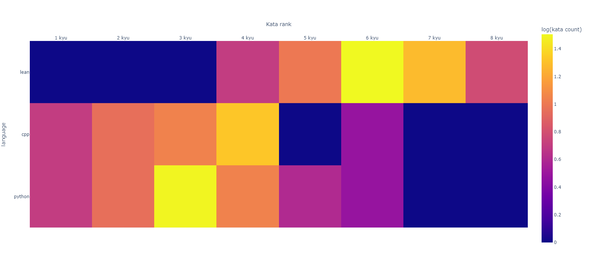
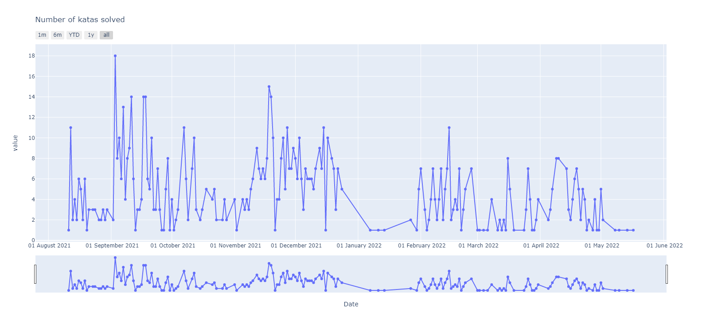

# codewars-stats-visualiser
visualize your training streaks and detailed stats on each language you have trained on.
# Features from Codewars Red #
- [ ] Streaks data
- [ ] Detailed stats on each language you have trained on.

# Features #
## Activity heatmap ##

## Interactive heatmap ##

[View online interactive version]()

## Interactive timeseries ##

[View online interactive version]()

## Interactive pie charts ##

[View online interactive version]()

# Usage # 

## Dependencies ##

### TLDR ##
- Fork project
- Install dependencies
- Change username in `main` to your username
- Run `main.py` 
