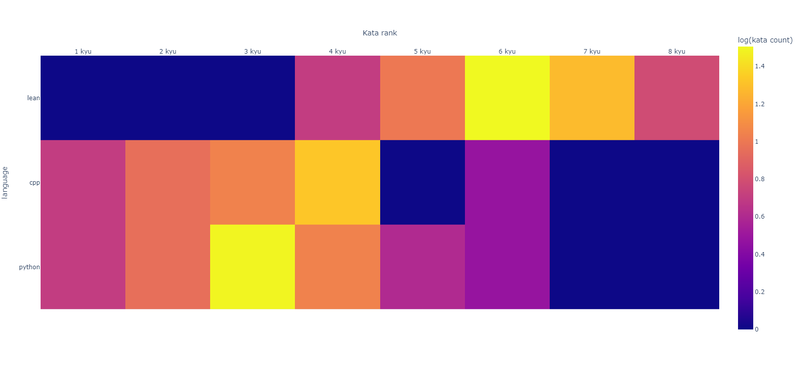
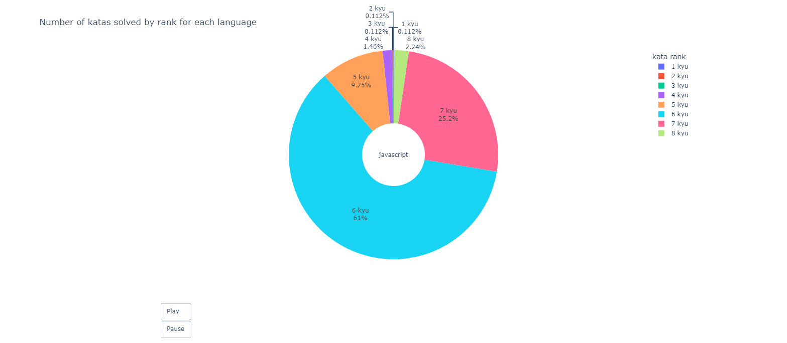

<p align="center">

 <h2 align="center"> stats visualiser</h2>
 <p align="center">Visualize your training streaks and detailed stats on each language you have trained on.</p>
</p>


 


# Features #
## Activity heatmap ##


## Interactive heatmap ##

[View online interactive version](https://creme332.github.io/interactive/codewars/heatmap/)

## Interactive timeseries ##

[View online interactive version](https://creme332.github.io/interactive/codewars/timeseries/)

## Interactive pie charts ##

[View online interactive version](https://creme332.github.io/interactive/codewars/piechart/)

# Usage # 

## Dependencies ##
```
numpy 1.20.3
calplot 0.1.7.4
matplotlib 3.4.3 
plotly 5.8.0
pandas 1.3.4
requests 2.26.0
ratelimit 2.2.1
```
- Fork project.
- Optional : empty  `charts` and `data` folder (but do not delete them)
- Install dependencies.
- Run `main.py` with your username as parameter in the main function. 
- All data collected are saved to the `data` folder and all charts generated are saved to the `charts` folder.


## Reduce time taken to collect data ##
Default API calls settings in `codewars_data_collection.py` :
```python
# At most 50 API calls are made per minute
CALLS = 50 
RATE_LIMIT = 60
# Approx time in seconds to collect all data = (number of katas) * 1.2

```
This current setting prevents the program from  making too many API calls. However, this can cause the data collection process to take longer.

To speed up the process, you increase the value of `CALLS`. As a rule of thumb, if you have solved below 200 katas in total, you can update the value `CALLS` to 10000. This will allow the program to make the maximum API calls possible without causing any error.

## Change file extension of charts ##
- All the interactive charts will be saved as an html file. File formats can be changed by modifying the file extensions in `main()` function 
```python
# available extensions = pdf, svf, png, html
InteractiveHeatmap(source_file_name + "language_rank_count",
destination_file_name +
"interactiveheatmap.pdf") # <- change file extension 
```

# Future work #
- [ ] Extract streaks data (most in a single day, most in a single week, most consecutive days)
- [ ] Extract first and last completed date for each language
- [ ]Visualise completed kata vs language
- [ ] Fix glitch in interactive pie chart (sloppy animation because of small lines representing small % emerging from pie chart)
- [ ] Login to extract solution votes, ...
