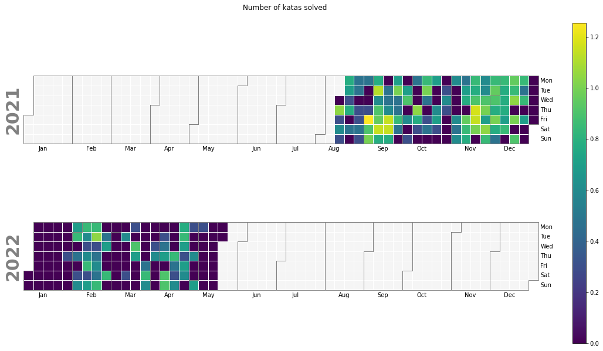
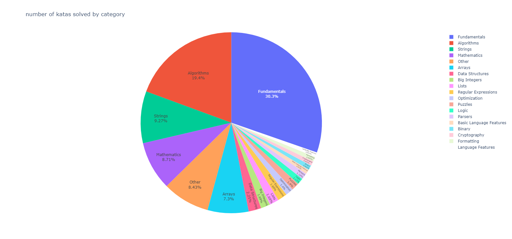
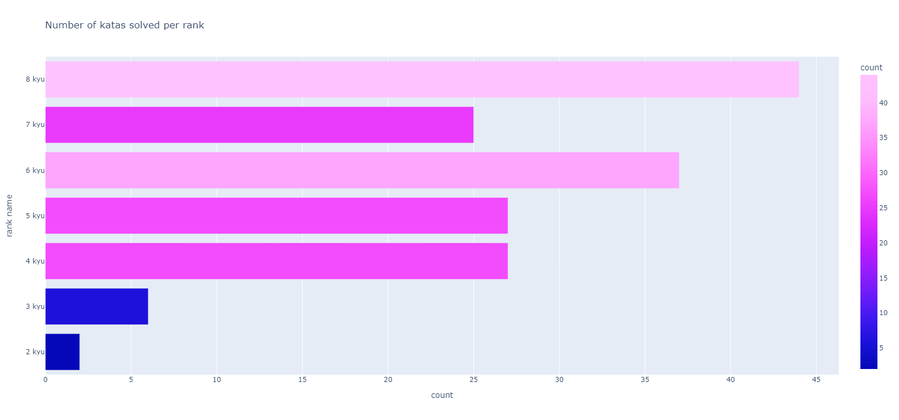
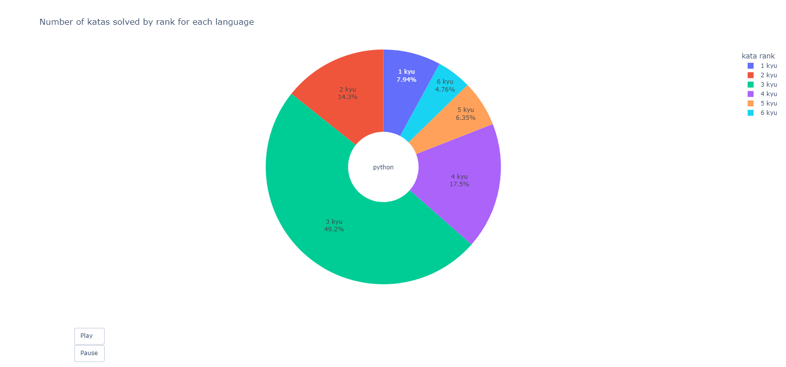

<p align="center">

 <h2 align="center"> stats visualiser</h2>
 <p align="center">Visualize your <a href="https://www.codewars.com/">codewars</a>
 training streaks and detailed statistics on each programming language you have trained on. </p>
</p>


 


# Features #
[View online interactive version](https://creme332.github.io/codewars-stats-visualiser/output)

## View  your activity ##



## View your training stats ##









# Usage 
Clone project:
```sh
git clone git@github.com:creme332/codewars-stats-visualiser.git
```
Install dependencies:
```
pip install -r requirements.txt
```
Run program with your username as parameter:
```sh
python src/main.py --username creme332
```
Open `output/index.html` to view results.
You should expect to wait at most 2 mins  for your results to come in.

All data collected from your profile are saved to the `data/user-data` folder and all charts generated are saved to the `output/charts` folder. 

Katas in beta have no rank and have been omitted during data analysis.

# Future work #
- [ ] convert into a web service
- [x] add python linter
- [ ] add tests
- [ ] use github actions to periodically update katalibrary
- [ ] create virtual env
## Features
- [ ] Add option to compare different users on the same charts
- [ ] Add an [interactive calendar heatmap](https://towardsdatascience.com/developing-a-timeseries-heatmap-in-python-using-plotly-fcf1d69575a3) with option to toggle years. (similar to Leetcode's heatmap) 
- [ ] Add more visuals : chord diagram, bar chart, bubble chart
- [ ] Login to extract solution votes, ...
- [ ] Authored kata stats

## Data collection
- [ ] Extract streaks data (most in a single day, most in a single week, most consecutive days)
- [ ] Extract first and last completed date for each language
- [ ]  Extract total honor for each language
- [ ] Authored katas
- [ ] Visualise completed kata vs language

## Performance
- [ ] In `main.py` optimise `get_language_rank_df()` by using panda [functions](https://stackoverflow.com/questions/35623772/changing-structure-of-pandas-dataframe).
